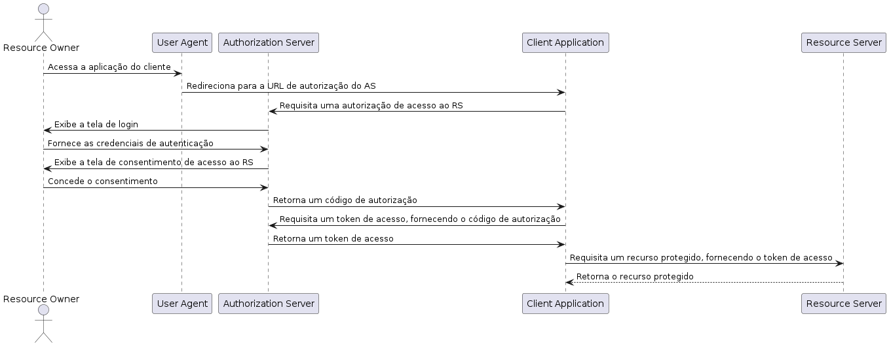

# Authorization Code Flow

O fluxo Authorization Code Flow é geralmente recomendado para aplicativos web e aplicativos móveis confiáveis. Ele fornece um alto nível de segurança ao lidar com autorização e autenticação de usuários em um servidor de recursos.

Este fluxo é particularmente adequado quando você possui um servidor back-end seguro que pode proteger seu segredo de cliente (client secret). No fluxo Authorization Code, o aplicativo solicita ao servidor de autorização (authorization server) um código de autorização, que é então trocado por um token de acesso. Essa troca ocorre no servidor back-end, onde as credenciais confidenciais podem ser armazenadas com segurança e a comunicação é realizada por meio de chamadas de back-end.

O fluxo Authorization Code Flow é mais seguro do que o fluxo Implicit Flow, pois o token de acesso não é exposto diretamente no navegador do usuário. Além disso, ele permite a renovação de tokens de acesso sem exigir que o usuário forneça novamente suas credenciais de autenticação.

Em resumo, o fluxo Authorization Code Flow é recomendado para aplicativos web e móveis confiáveis, nos quais a segurança é uma preocupação essencial e existe um servidor back-end seguro para gerenciar as interações com o servidor de autorização.

## Single Sign On

Similar ao Implicit Flow, o Authorization Code Flow também suporta Single Sign On (SSO). O SSO permite que um usuário faça login em um aplicativo e seja autenticado em outros aplicativos automaticamente, sem precisar fornecer suas credenciais novamente.

## Attacks

### Nonce (number used once) Replay Attack

O ataque Nonce Replay ocorre quando um invasor intercepta um token de ID e o reutiliza para obter acesso a recursos protegidos. Para evitar esse ataque, o servidor de recursos deve verificar se o nonce no token de ID corresponde ao nonce no token de acesso.

O nonce é um parâmetro usado para evitar ataques de repetição (replay attacks) em protocolos de autenticação baseados em tokens, como o OAuth 2.0 e o OpenID Connect. O termo "nonce" significa "number used once" (número usado apenas uma vez), indicando que o valor do parâmetro deve ser único para cada solicitação de autenticação.

### State Parameter CSRF Attack (Cross-Site Request Forgery)

O ataque CSRF ocorre quando um invasor engana um usuário para que ele execute uma ação em um aplicativo web sem o conhecimento do usuário. Para evitar esse ataque, o aplicativo deve usar um parâmetro de estado (state parameter) para verificar se a resposta recebida do servidor de autorização corresponde à solicitação original.

O state é um valor aleatório gerado pelo cliente antes de enviar a solicitação de autenticação e incluído na solicitação. O servidor de autenticação inclui o mesmo valor do state na resposta de autenticação, permitindo que o cliente verifique se a resposta é uma resposta legítima à solicitação original. Isso ajuda a evitar ataques de CSRF, em que um invasor engana um usuário para enviar uma solicitação maliciosa sem o conhecimento do usuário.

